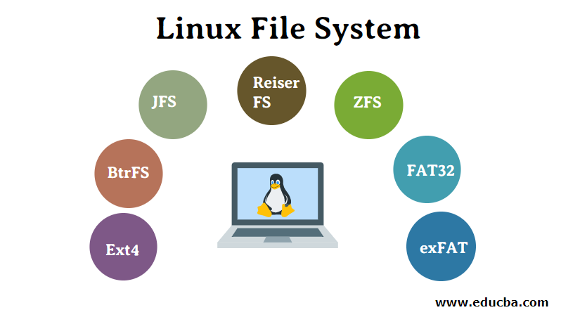

## Desktop Environments
 * Some of the more well known Desktop Environments are GNOME and KDE
     * GUI: (Graphical User Interface) a set of programs that allows users to use their computers via icons, links, windows and other visual aspects. 
     * A desktop environment (DE) are graphical shells that are comprised of a myriad of computer programs that overlay the OS. 

## What are Shells?
 * Programs that provides access to the Linux system 
 * Bash shells are the more commonly used shells 
 * They are seen on the Command Line Interface (CLI)

## Linux File Systems 
* 